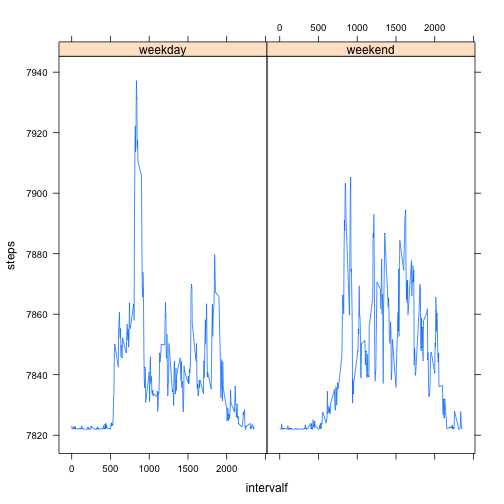

Reproducible Research: Peer Assessment 1
==================================================

## Loading and preprocessing the data
1. Load the data 

```r
# create a temporary directory
td = tempdir()
# get the name of the first file in the zip archive
fname = unzip("activity.zip", list=TRUE)$Name
# unzip the file to the temporary directory
unzip("activity.zip", files=fname, exdir=td, overwrite=TRUE)
# fpath is the full path to the extracted file
fpath = file.path(td, fname)
# read the file
d = read.csv(fpath, header=TRUE, row.names=NULL, 
             stringsAsFactors=FALSE)
```
2. Process/transform the data (if necessary) into a format suitable for your analysis

```r
d$date <- as.Date(d$date)
```

## What is mean total number of steps taken per day?
1. Make a histogram of the total number of steps taken each day

```r
# function to sum step in a Date
date_factor <- as.factor(d$date)
step_per_day <- tapply(d$steps,date_factor,sum,na.rm =T)
head(step_per_day)
```

```
## 2012-10-01 2012-10-02 2012-10-03 2012-10-04 2012-10-05 2012-10-06 
##          0        126      11352      12116      13294      15420
```

```r
hist(step_per_day)
```

 
2. Calculate and report the mean and median total number of steps taken per day

```r
# mean and median total number of steps taken per day
# step_per_day<-tapply(d_clean$steps,as.factor(d_clean$date),sum)
mean(step_per_day) #[1] 9354.23
```

```
## [1] 9354.23
```

```r
# median total number of steps taken per day
median(step_per_day) #[1] 10395
```

```
## [1] 10395
```

## What is the average daily activity pattern?
1.  Make a time series plot (i.e. type = "l") of the 5-minute interval (x-axis) and the average number of steps taken, averaged across all days (y-axis)

```r
# replace NA by 0 
d_clean <- na.omit(d)
step_per_interval<-tapply(d_clean$steps,as.factor(d_clean$interval),mean)
intervals <-levels(as.factor(d_clean$interval))
plot(intervals,step_per_interval,type="l")
```

 
2.Which 5-minute interval, on average across all the days in the dataset, contains the maximum number of steps?

```r
intervals[max.col(t(step_per_interval))]
```

```
## [1] "835"
```


## Imputing missing values
Note that there are a number of days/intervals where there are missing values (coded as NA). The presence of missing days may introduce bias into some calculations or summaries of the data.

1. Calculate and report the total number of missing values in the dataset
(i.e. the total number of rows with NAs)

```r
na_idx <- is.na(d)
sum(na_idx)
```

```
## [1] 2304
```

2. Devise a strategy for filling in all of the missing values in the dataset. The strategy does not need to be sophisticated. For example, you could use the mean/median for that day, or the mean for that 5-minute interval, etc.


3. Create a new dataset that is equal to the original dataset but with the missing data filled in.

```r
d_clean2 <- d
# replace na by the mean for that 5-minute interval
d_clean2[na_idx[,"steps"],"steps"]<-step_per_interval[as.character(d_clean2[na_idx[,"steps"],"interval"])]
d_clean2$steps[1:5]==step_per_interval[1:5]
```

```
##    0    5   10   15   20 
## TRUE TRUE TRUE TRUE TRUE
```


4. Make a histogram of the total number of steps taken each day and Calculate and report the mean and median total number of steps taken per day. Do these values differ from the estimates from the first part of the assignment? What is the impact of imputing missing data on the estimates of the total daily number of steps?

```r
step_per_day2 <- tapply(d_clean2$steps,date_factor,sum)
head(step_per_day2)
```

```
## 2012-10-01 2012-10-02 2012-10-03 2012-10-04 2012-10-05 2012-10-06 
##   10766.19     126.00   11352.00   12116.00   13294.00   15420.00
```

```r
plot(step_per_day2,type="l")
```

 

```r
# histogram
hist(step_per_day2)
```

 

## Are there differences in activity patterns between weekdays and weekends?
For this part the weekdays() function may be of some help here. Use the dataset with the filled-in missing values for this part.

1. Create a new factor variable in the dataset with two levels – “weekday” and “weekend” indicating whether a given date is a weekday or weekend day.

```r
weekend_factor<-weekdays(as.Date(levels(date_factor)))
weekend_idx<-weekend_factor %in% c("Saturday","Sunday")
weekend_factor[weekend_idx]<-"weekend"
weekend_factor[!weekend_idx]<-"weekday"
weekend_factor<-as.factor(weekend_factor)
weekend_factor
```

```
##  [1] weekday weekday weekday weekday weekday weekend weekend weekday
##  [9] weekday weekday weekday weekday weekend weekend weekday weekday
## [17] weekday weekday weekday weekend weekend weekday weekday weekday
## [25] weekday weekday weekend weekend weekday weekday weekday weekday
## [33] weekday weekend weekend weekday weekday weekday weekday weekday
## [41] weekend weekend weekday weekday weekday weekday weekday weekend
## [49] weekend weekday weekday weekday weekday weekday weekend weekend
## [57] weekday weekday weekday weekday weekday
## Levels: weekday weekend
```

2. Make a panel plot containing a time series plot (i.e. type = "l") of the 5-minute interval (x-axis) and the average number of steps taken, averaged across all weekday days or weekend days (y-axis). The plot should look something like the following, which was creating using simulated data:

```r
library("lattice")
head(d_clean2)
```

```
##       steps       date interval
## 1 1.7169811 2012-10-01        0
## 2 0.3396226 2012-10-01        5
## 3 0.1320755 2012-10-01       10
## 4 0.1509434 2012-10-01       15
## 5 0.0754717 2012-10-01       20
## 6 2.0943396 2012-10-01       25
```

```r
# add weekend factor
d_clean2$weekendfactor = as.factor(sapply(1:61,
                                          FUN=function(x)
                                            {rep(weekend_factor[x],288)}
                                          )[1:17568])
d_clean2$interval <- as.factor(d_clean2$interval)
head(d_clean2)
```

```
##       steps       date interval weekendfactor
## 1 1.7169811 2012-10-01        0       weekday
## 2 0.3396226 2012-10-01        5       weekday
## 3 0.1320755 2012-10-01       10       weekday
## 4 0.1509434 2012-10-01       15       weekday
## 5 0.0754717 2012-10-01       20       weekday
## 6 2.0943396 2012-10-01       25       weekday
```

```r
str(d_clean2)
```

```
## 'data.frame':	17568 obs. of  4 variables:
##  $ steps        : num  1.717 0.3396 0.1321 0.1509 0.0755 ...
##  $ date         : Date, format: "2012-10-01" "2012-10-01" ...
##  $ interval     : Factor w/ 288 levels "0","5","10","15",..: 1 2 3 4 5 6 7 8 9 10 ...
##  $ weekendfactor: Factor w/ 2 levels "weekday","weekend": 1 1 1 1 1 1 1 1 1 1 ...
```

```r
# use reshape lib to calculate the grouped average
#install.packages("reshape")
library(reshape)
d_clean3 <- cast(melt(d_clean2,id=c("weekendfactor","interval")),weekendfactor~interval,mean)
dim(d_clean3)
```

```
## [1]   2 289
```

```r
head(d_clean3)
```

```
##   weekendfactor        0        5       10       15       20       25
## 1       weekday 7823.126 7822.223 7822.087 7822.099 7822.049 7822.795
## 2       weekend 7822.107 7822.021 7822.008 7822.009 7822.005 7823.756
##         30       35   40       45       50       55     100      105
## 1 7822.346 7822.569 7822 7822.898 7822.198 7822.009 7822.21 7822.045
## 2 7822.033 7822.054 7822 7822.279 7822.019 7822.227 7822.02 7823.167
##        110      115  120     125      130      135      140      145
## 1 7822.099 7822.223 7822 7822.73 7823.111 7822.011 7822.111 7822.125
## 2 7822.009 7822.021 7822 7822.07 7822.364 7822.292 7822.011 7822.367
##        150  155  200  205      210  215  220      225  230      235  240
## 1 7822.173 7822 7822 7822 7822.698 7822 7822 7822.087 7822 7822.148 7822
## 2 7822.017 7822 7822 7822 7822.196 7822 7822 7822.008 7822 7822.014 7822
##    245      250      255  300  305  310  315      320      325      330
## 1 7822 7823.014 7822.618 7822 7822 7822 7822 7822.014 7822.408 7822.619
## 2 7822 7822.097 7822.059 7822 7822 7822 7822 7822.357 7822.039 7823.351
##        335      340      345  350  355      400      405      410  415
## 1 7822.261 7822.210 7822.049 7822 7822 7822.135 7822.618 7823.116 7822
## 2 7822.380 7822.343 7822.005 7822 7822 7823.887 7822.059 7823.754 7822
##        420      425      430      435      440      445      450      455
## 1 7822.223 7822.024 7823.685 7822.111 7823.888 7822.444 7823.174 7822.363
## 2 7822.021 7822.616 7825.101 7822.948 7823.343 7822.333 7824.632 7823.101
##    500      505      510      515      520      525      530      535
## 1 7822 7823.027 7823.967 7823.094 7824.110 7823.353 7823.373 7825.970
## 2 7822 7822.098 7822.188 7823.203 7822.395 7823.841 7822.131 7822.379
##        540      545      550      555      600      605      610      615
## 1 7832.201 7833.823 7847.175 7850.133 7842.644 7854.295 7857.040 7860.575
## 2 7823.845 7823.709 7826.403 7827.687 7823.968 7825.079 7825.955 7834.466
##        620      625      630      635      640      645      650      655
## 1 7853.964 7852.016 7855.221 7845.989 7849.835 7849.434 7845.524 7852.214
## 2 7827.341 7827.317 7827.978 7829.521 7827.626 7829.042 7827.054 7830.502
##        700      705      710      715      720      725      730      735
## 1 7847.299 7847.414 7853.012 7856.667 7853.551 7851.554 7855.112 7849.177
## 2 7834.363 7835.117 7831.063 7828.407 7828.433 7836.061 7835.011 7830.051
##        740      745      750      755      800      805      810      815
## 1 7853.362 7863.692 7855.868 7855.288 7863.358 7857.981 7894.007 7912.991
## 2 7833.423 7837.315 7837.022 7835.416 7845.555 7850.825 7866.215 7866.377
##        820      825      830      835      840      845      850      855
## 1 7922.288 7913.804 7921.442 7937.189 7931.451 7914.827 7917.615 7910.546
## 2 7866.197 7860.025 7880.300 7891.042 7887.652 7903.223 7902.681 7891.345
##        900      905      910      915      920      925      930      935
## 1 7905.830 7884.891 7868.974 7865.652 7873.770 7868.231 7851.258 7839.926
## 2 7859.685 7881.565 7897.882 7905.320 7874.107 7874.904 7865.919 7857.795
##        940      945      950      955     1000     1005     1010     1015
## 1 7835.731 7842.428 7841.565 7830.815 7840.938 7831.110 7841.539 7845.911
## 2 7830.643 7838.422 7833.655 7837.347 7846.067 7847.811 7847.901 7855.135
##       1020     1025     1030     1035     1040     1045     1050     1055
## 1 7837.173 7839.575 7838.563 7834.128 7833.758 7834.956 7833.017 7833.630
## 2 7853.527 7869.393 7859.830 7859.213 7855.075 7839.584 7838.850 7850.184
##       1100     1105     1110     1115     1120     1125     1130     1135
## 1 7832.846 7834.545 7827.844 7830.136 7834.092 7833.865 7838.384 7847.099
## 2 7851.272 7843.292 7846.208 7847.815 7842.086 7839.092 7839.652 7846.686
##       1140     1145     1150     1155     1200     1205     1210     1215
## 1 7844.280 7845.962 7847.058 7850.068 7849.858 7858.424 7863.823 7859.640
## 2 7839.471 7839.631 7839.284 7855.887 7865.398 7886.731 7885.178 7892.986
##       1220     1225     1230     1235     1240     1245     1250     1255
## 1 7846.360 7845.411 7853.287 7837.372 7832.991 7836.660 7838.393 7850.297
## 2 7874.337 7851.792 7837.842 7840.557 7841.658 7852.702 7861.785 7870.674
##       1300     1305     1310     1315     1320     1325     1330     1335
## 1 7834.300 7834.870 7834.284 7829.821 7839.816 7844.429 7837.884 7833.653
## 2 7868.115 7861.837 7869.923 7878.124 7860.047 7866.496 7858.828 7837.133
##       1340     1345     1350     1355     1400     1405     1410     1415
## 1 7834.620 7842.092 7834.788 7840.165 7845.461 7841.775 7838.061 7844.524
## 2 7862.685 7867.565 7876.239 7886.832 7862.297 7865.435 7859.912 7851.481
##       1420     1425     1430     1435     1440     1445     1450     1455
## 1 7835.743 7837.381 7837.745 7829.256 7827.774 7832.994 7842.930 7841.140
## 2 7850.967 7850.315 7857.491 7854.032 7838.382 7840.786 7846.289 7851.611
##       1500     1505     1510     1515     1520     1525     1530     1535
## 1 7837.435 7839.527 7836.977 7837.957 7841.931 7840.673 7843.064 7847.466
## 2 7835.814 7841.473 7847.531 7851.178 7853.560 7860.516 7854.508 7874.895
##       1540     1545     1550     1555     1600     1605     1610     1615
## 1 7867.283 7869.933 7868.974 7857.153 7845.442 7844.598 7850.303 7840.067
## 2 7852.682 7875.260 7884.538 7883.185 7874.508 7880.696 7884.503 7891.604
##       1620     1625     1630     1635     1640     1645     1650     1655
## 1 7835.405 7836.763 7833.258 7832.916 7834.933 7837.997 7835.814 7838.212
## 2 7892.775 7894.423 7873.960 7864.817 7870.760 7863.653 7871.232 7859.667
##       1700     1705     1710     1715     1720     1725     1730     1735
## 1 7833.786 7844.476 7839.092 7846.037 7852.059 7858.185 7850.074 7854.911
## 2 7877.726 7866.113 7870.607 7871.108 7876.076 7870.715 7874.465 7843.166
##      1740     1745     1750     1755     1800     1805     1810     1815
## 1 7863.44 7851.667 7839.252 7840.797 7835.323 7845.312 7855.613 7863.321
## 2 7848.60 7846.282 7839.767 7840.528 7862.074 7867.032 7869.856 7868.426
##       1820     1825     1830     1835     1840     1845     1850     1855
## 1 7852.695 7858.729 7861.613 7862.750 7867.856 7879.730 7872.650 7867.296
## 2 7848.642 7847.892 7858.700 7848.922 7855.709 7849.216 7844.599 7857.788
##       1900     1905     1910     1915     1920     1925     1930     1935
## 1 7865.780 7860.611 7853.191 7849.191 7840.944 7832.281 7836.549 7844.990
## 2 7860.648 7861.771 7844.909 7847.241 7837.958 7832.576 7833.306 7833.626
##       1940     1945     1950     1955     2000     2005     2010     2015
## 1 7837.025 7831.292 7844.133 7835.646 7828.697 7824.779 7825.412 7829.056
## 2 7837.325 7844.565 7846.791 7847.533 7840.570 7850.439 7849.271 7865.709
##       2020     2025     2030     2035     2040     2045     2050     2055
## 1 7826.354 7824.856 7826.887 7825.578 7826.481 7828.555 7834.987 7830.655
## 2 7860.863 7854.323 7860.300 7852.615 7846.659 7844.208 7847.050 7836.072
##       2100     2105     2110     2115     2120     2125     2130     2135
## 1 7827.685 7831.448 7836.252 7831.472 7829.141 7826.023 7828.400 7830.253
## 2 7836.403 7828.264 7826.622 7832.047 7825.653 7825.970 7831.948 7829.863
##       2140     2145     2150     2155     2200     2205     2210     2215
## 1 7825.568 7825.797 7826.131 7823.719 7822.764 7824.212 7825.154 7827.578
## 2 7828.511 7826.175 7825.883 7822.164 7822.622 7822.792 7822.301 7822.532
##       2220     2225     2230     2235     2240     2245     2250     2255
## 1 7826.638 7827.424 7828.395 7823.447 7822.021 7822.074 7822.951 7823.007
## 2 7822.442 7823.325 7822.610 7822.138 7822.551 7822.007 7822.381 7827.944
##       2300     2305 2310     2315     2320     2325     2330     2335
## 1 7823.776 7823.868 7822 7822.544 7822.631 7822.939 7823.518 7823.124
## 2 7823.300 7822.178 7822 7822.052 7822.060 7822.380 7822.694 7827.794
##       2340     2345     2350     2355
## 1 7823.120 7822.132 7822.148 7822.705
## 2 7825.144 7822.853 7822.014 7822.067
```

```r
d_clean4 <-data.frame(weekendf=as.factor(c(rep("weekday",288),rep("weekend",288))),
                     intervalf=as.numeric(rep(names(step_per_interval),2)),
                     steps=as.numeric(cbind(d_clean3[1,2:289],d_clean3[2,2:289])))
head(d_clean4)
```

```
##   weekendf intervalf    steps
## 1  weekday         0 7823.126
## 2  weekday         5 7822.223
## 3  weekday        10 7822.087
## 4  weekday        15 7822.099
## 5  weekday        20 7822.049
## 6  weekday        25 7822.795
```

```r
xyplot(steps ~ intervalf|weekendf,data=d_clean4,type="l")
```

 

